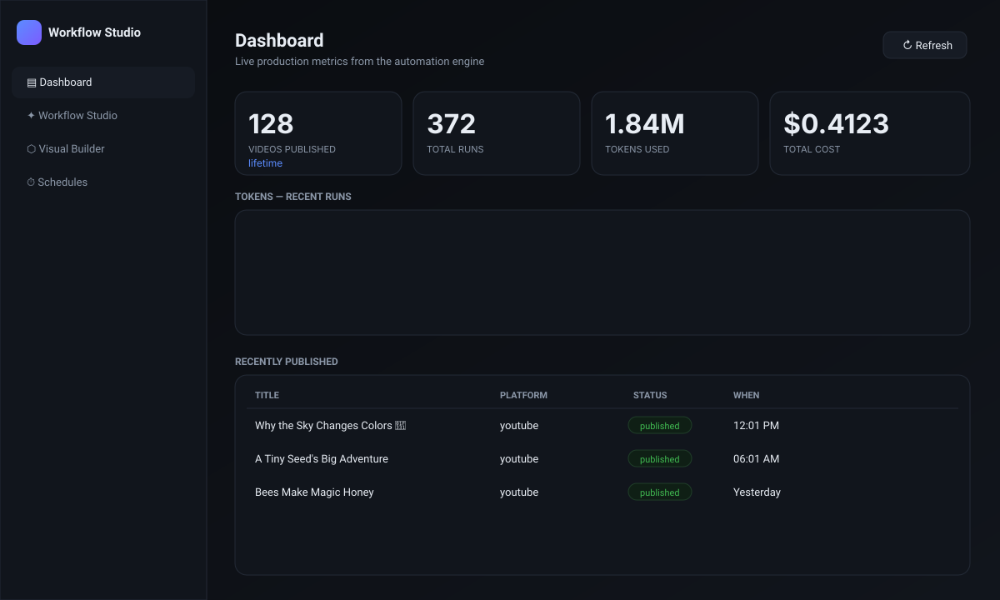
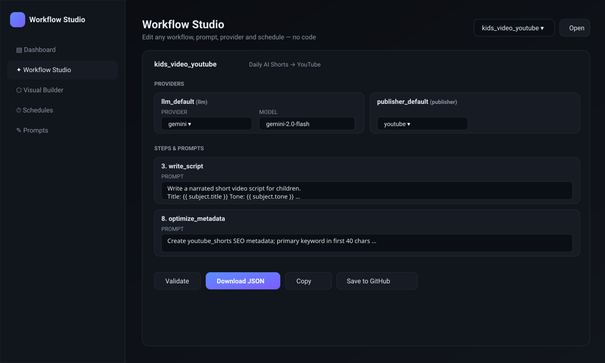
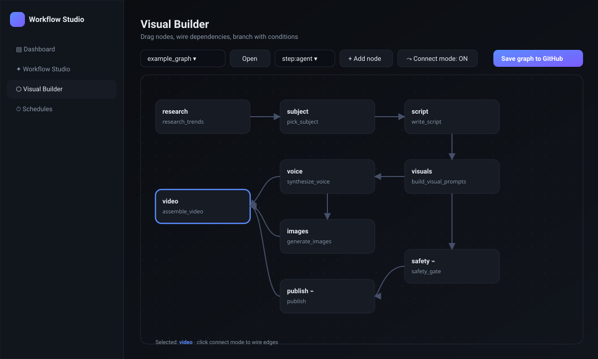

<<<<<<< HEAD
# Agentry
=======
# Workflow Studio
>>>>>>> 4f66566cb65003080ea71b565cf90c174c7c1ad0

> **Config-driven, agentic content-automation engine. n8n-style visual builder, runs free on GitHub.**
> Bring an LLM key, point at a JSON workflow, get videos shipping on a schedule.

<p>
  
  
  
  
  
</p>

---

<p align="center">
  
  <br><em>Live dashboard — videos, tokens, cost, schedule status</em>
</p>
<p align="center">
<<<<<<< HEAD
  
  <br><em>Agentry — change any provider/model/prompt from the UI</em>
=======
  
  <br><em>Workflow Studio — change any provider/model/prompt from the UI</em>
>>>>>>> 4f66566cb65003080ea71b565cf90c174c7c1ad0
</p>
<p align="center">
  
  <br><em>Visual Builder — drag, connect, branch · same JSON the engine runs</em>
</p>

> Mockups committed in-repo so the README has visuals immediately. Replace with
> real screenshots from your own live deploy under `site/assets/shots/` (same
> filenames) and they'll appear here automatically.

---

## What it is

A **universal workflow engine** with first-class agentic and video-native
support. Every part (LLM, TTS, image, video, publisher, prompt, schedule) is a
**config** — no hardcoding, no rebuild, swap providers from the UI. It ships
with a working **kids-video → YouTube** pipeline as one example; the same
engine runs *any* workflow you wire up in JSON or the visual builder.

## Why it exists

n8n, Make, Zapier are great but **not free, not self-hosted by default, not
<<<<<<< HEAD
content-native, and not agentic**. Agentry is:

| | Agentry | n8n (cloud) | Make | Zapier |
=======
content-native, and not agentic**. Workflow Studio is:

| | Workflow Studio | n8n (cloud) | Make | Zapier |
>>>>>>> 4f66566cb65003080ea71b565cf90c174c7c1ad0
|---|---|---|---|---|
| Free self-hosted | ✅ GitHub Actions + Pages | partial (self-host work) | ❌ | ❌ |
| Config-driven workflows (JSON) | ✅ | partial | partial | ❌ |
| Visual node builder | ✅ (zero-build SVG) | ✅ | ✅ | ❌ |
| **Agentic planner→executor built in** | ✅ | ❌ | ❌ | ❌ |
| Video/audio pipeline (ffmpeg native) | ✅ | ❌ | ❌ | ❌ |
| One-file plugin model | ✅ | partial | ❌ | ❌ |
| Live token/cost telemetry + budget breaker | ✅ | ❌ | ❌ | ❌ |
| Content safety gate | ✅ | ❌ | ❌ | ❌ |

## Features at a glance

- 🧠 **Agent mode** — LLM planner picks tools from a manifest, executor runs
  them with budget + allow-list guardrails
- 🧩 **Plugin-based** — providers (Gemini/Claude/OpenAI/TTS/image/video/
  publisher), steps, and tools all register from one file each
- ⬡ **Visual builder** — drag-and-connect SVG canvas, exports the same graph
  JSON the engine runs
- 🎬 **Video-native** — ffmpeg slideshow with sidechain-ducked audio, ASS
  captions, graceful fallback
- ⏱ **Scheduler** — per-workflow cron registry, 30-min dispatcher, exactly-once
- 💸 **Cost-aware** — every LLM call metered, runtime budget circuit-breaker
- 🛡 **Safety + secrets** — content safety gate, env-only secrets, PBKDF2
  admin auth at deploy, masked logs
- 📊 **Live dashboard** — videos published, tokens, cost, schedule status

## 60-second quickstart (local, no keys, no cost)

```bash
<<<<<<< HEAD
git clone https://github.com/YOUR/agentry && cd agentry
python3 -m venv .venv && source .venv/bin/activate
pip install -r requirements.txt          # ffmpeg required for video: brew/apt install ffmpeg
python -m agentry.cli doctor                  # preflight
python -m agentry.cli run workflows/kids_video_youtube.json --dry-run
=======
git clone https://github.com/YOUR/workflow-studio && cd workflow-studio
python3 -m venv .venv && source .venv/bin/activate
pip install -r requirements.txt          # ffmpeg required for video: brew/apt install ffmpeg
python -m src.cli doctor                  # preflight
python -m src.cli run workflows/kids_video_youtube.json --dry-run
>>>>>>> 4f66566cb65003080ea71b565cf90c174c7c1ad0
```

The dry-run produces a real `.mp4` with placeholder media and saves it
locally — no keys, no API calls, no spend. Open `site/index.html` for the
dashboard, `site/studio.html` for the editor, `site/graph.html` for the
visual builder.

## Run with Docker (self-host, two apps)

A lightweight Compose stack with **two services** sharing volumes:

- `web` → static dashboard, Studio, Visual Builder on **port 8000**
- `worker` → scheduler dispatcher that runs due workflows on a loop

```bash
cp .env.example .env       # fill in keys; .env stays on your host, never in the image
docker compose build
docker compose up -d
open http://localhost:8000  # dashboard
docker compose logs -f worker
docker compose down
```

Image is `python:3.12-slim` + `ffmpeg` (~250 MB). Secrets are injected from
`.env` at runtime — not baked into the image. State and stats persist in the
host `./state` and `./site/data` volumes. Full docs in [docs/DOCKER.md](docs/DOCKER.md).

## Deploy free on GitHub (one-time, ~10 min)

Full step-by-step in [DEPLOY.md](DEPLOY.md). TL;DR:

1. **Get a Gemini API key** at [aistudio.google.com/apikey](https://aistudio.google.com/apikey).
2. **Get YouTube OAuth tokens** locally: `python scripts/youtube_auth.py client_secret.json`.
3. **Push to your repo** (`git remote add origin … && git push -u origin main`).
4. **Add Secrets** in repo Settings: `GEMINI_API_KEY`, `YOUTUBE_CLIENT_ID/SECRET/REFRESH_TOKEN`. (Optional: `ADMIN_USERNAME`/`ADMIN_PASSWORD` to lock the dashboard editor.)
5. **Settings → Pages → Source: GitHub Actions.**
6. **Actions → video-workflow → Run workflow** with `dry_run = true` first to verify, then `false` to go live.

The scheduler dispatches due workflows every 30 minutes; you do nothing.

## Build any workflow (no code)

A workflow is one JSON file in `workflows/`. Two shapes, same engine:

- **Linear** — `steps: [...]` (simplest)
- **Graph** — `nodes: [{id, type, needs, when, params}]` (n8n-style DAG)

Swap any provider/model/prompt by editing the file or from the Studio UI.
See [docs/ADDING_WORKFLOWS.md](docs/ADDING_WORKFLOWS.md).

### Add a new provider/tool/step
One file, one decorator, auto-registered:
```python
<<<<<<< HEAD
from agentry.core.registry import provider
from agentry.providers.llm.base import LLMProvider, LLMResult
=======
from src.core.registry import provider
from src.providers.llm.base import LLMProvider, LLMResult
>>>>>>> 4f66566cb65003080ea71b565cf90c174c7c1ad0

@provider("llm", "myprovider")
class MyProvider(LLMProvider):
    def _complete(self, prompt, system, **_):
        ...
        return LLMResult(text=text, prompt_tokens=p, completion_tokens=c, model=self.model)
```

## Example workflows shipped

- `kids_video_youtube.json` — daily AI Shorts → YouTube (linear, 11 steps with safety gate)
- `example_graph.json` — same pipeline as a **DAG** (proves n8n-style mode)
- `example_agent_audio.json` — **agentic** planner picks free audio tools
- `example_instagram_reel.json` — same engine, different platform (proves universality)

## Honest scope

- **Free except LLM tokens.** Hosted entirely on GitHub Actions + Pages.
- **Revenue is not automatic.** This system removes the labor of publishing;
  reach/monetization depend on niche, content, and platform algorithms — not on this code.
- **You are responsible** for compliance with the ToS of any platform you publish to
  (YouTube, Instagram, etc.) and with laws applicable to content you generate, including
  those protecting minors. See [LICENSE](LICENSE) and [SECURITY.md](SECURITY.md).

## Roadmap

- ✅ Engine + scheduler + dashboard + agent + visual builder + safety + budget breaker
- 🚧 P3 — scale (pluggable state, off-repo artifacts, parallel fan-out, observability)
- 🚧 P4 — security (Cloudflare auth recipe, SBOM, supply-chain scans)
- 🚧 P5 — coverage gate, mypy strict, mkdocs site
- 🚧 P6 — niche template gallery, plugin example repos, launch
- 🚧 P7 — YouTube analytics feedback loop (the moat)

Detail in [docs/ROADMAP_TO_9.md](docs/ROADMAP_TO_9.md).

## Docs

- [DEPLOY.md](DEPLOY.md) — exact deploy steps
- [docs/ADDING_WORKFLOWS.md](docs/ADDING_WORKFLOWS.md) — workflow schema + plugin recipes
- [docs/YOUTUBE_REACH.md](docs/YOUTUBE_REACH.md) — 2026 reach/SEO tactics baked into the pipeline
- [docs/ROADMAP_AGENTIC.md](docs/ROADMAP_AGENTIC.md) — agentic + n8n architecture
- [docs/ROADMAP_TO_9.md](docs/ROADMAP_TO_9.md) — plan to commercial 9.0
- [docs/ASSESSMENT.md](docs/ASSESSMENT.md) — honest product scorecard
- [docs/SELLING.md](docs/SELLING.md) — monetization & open-core guidance
- [SECURITY.md](SECURITY.md) — threat model & hardening
- [CHANGELOG.md](CHANGELOG.md)

## Contributing & community

Issues and PRs welcome. If this saves you time, please star ⭐ the repo — it
helps others discover it. A short demo screenshot or GIF in an issue is the
quickest way to suggest a UI improvement.

## License

MIT — see [LICENSE](LICENSE). No warranty of revenue, reach, or platform
acceptance. Built with care; ship responsibly.
